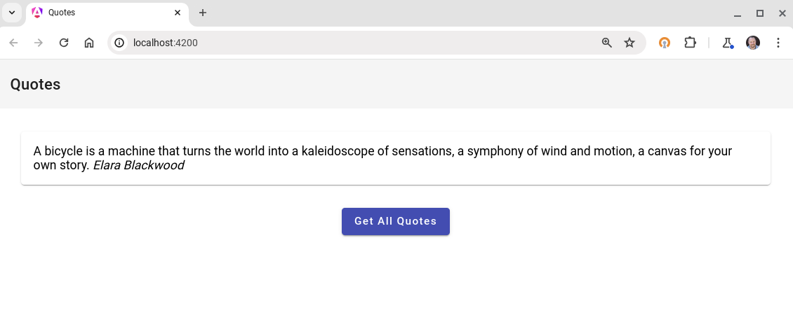

# Generative AI .NET 8 Sample

This .NET 8 minimal Web API generates random quotes using Google's Gemini 1.5 Flash large language model.  The app demonstrates calling Gemini using the [Vertex AI API](https://cloud.google.com/vertex-ai/docs/generative-ai/model-reference/gemini?_ga=2.228338718.-220341458.1702671073) using the latest [Google.Cloud.AIPlatform.V1](https://cloud.google.com/dotnet/docs/reference/Google.Cloud.AIPlatform.V1) .NET SDK package.  

There are 3 branches in this sample to follow along:

| Branch | Purpose |
|---|---|
| [main](https://github.com/jjdelorme/generative-quote) | Starting point for refactoring the app using Gemini Code Assist |
| [unit-tests](https://github.com/jjdelorme/generative-quote/tree/unit-tests) | Adds unit tests generated using Gemini Code Assist |
| [completed](https://github.com/jjdelorme/generative-quote/tree/completed) | Adds Gemini Code Assist generated Dockerfile and cloudbuild.yaml to deploy to Cloud Run |

You can also grab the simple Angular [companion web app](https://github.com/jjdelorme/quotes-web).



## Prerequisites

* This sample assumes you have a GCP project with the [Vertex AI API enabled](https://cloud.google.com/vertex-ai/docs/start/cloud-environment#enable_vertexai_apis)
* You have installed the [gcloud cli](https://cloud.google.com/sdk/docs/install)

### Update your GCP project ID

You can find your project id in the GCP console under the [project settings](https://support.google.com/googleapi/answer/7014113?hl=en). Update your `appsettings.json`:
```json
{
  "projectId": "YOUR_GCP_PROJECT_ID_HERE"
}
```

## Running

### Locally

To run locally ensure you have the [dotnet cli](https://dotnet.microsoft.com/en-us/download) installed. Configure [appsettings.json](appsettings.json) with your project and then run the app:

```sh
dotnet run
```

You can then use curl to generate quotes:

```sh
curl 'http://localhost:5000/random-quote?prompt=waterfalls'
```

### Deploying to Cloud Run
See the [completed](https://github.com/jjdelorme/generative-quote/tree/completed) branch for a complete example of how to deploy to Cloud Run using a Dockerfile and Cloud Build.


## End to End

Who doesn't love a CLI? Ok, but if you want a nice little Angular application to display these quotes see [this](/assets/e2e.md).


## Google SDK Reference

There are some [samples in C#](https://cloud.google.com/vertex-ai/generative-ai/docs/multimodal/send-chat-prompts-gemini#gemini-chat-samples-csharp) which demonstrate calling the Gemini Vertex API.  This code uses the [PredictionServiceClient](https://cloud.google.com/dotnet/docs/reference/Google.Cloud.AIPlatform.V1/latest/Google.Cloud.AIPlatform.V1.PredictionServiceClient) API.  

Use the SDK in your project by running the following command:

```bash
dotnet add package Google.Cloud.AIPlatform.V1
```
