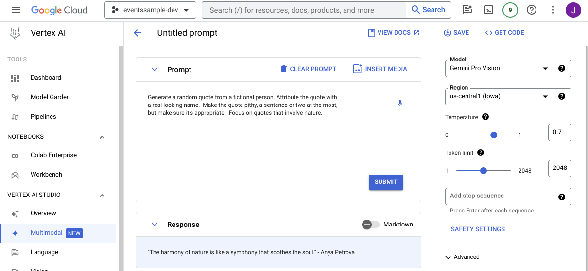
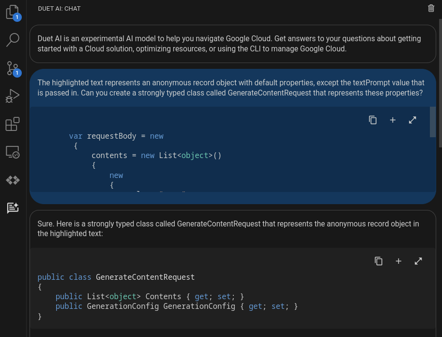

# Generative AI .NET 8 Sample

This sample application is written using the .NET 8 minimal Web API to demonstrate calling the Vertex [Generative AI API](https://cloud.google.com/vertex-ai/docs/generative-ai/model-reference/gemini?_ga=2.228338718.-220341458.1702671073) with the Gemini model.

Using **Vertex AI Studio** in the Google Cloud Consle you can easily design and test prompts.  You can also quickly generate code using the **<> GET CODE** button in the upper right.



## Prerequisites

* This sample assumes you have a GCP project with the [Vertex AI API enabled](https://cloud.google.com/vertex-ai/docs/start/cloud-environment#enable_vertexai_apis)
* You have installed the [gcloud cli](https://cloud.google.com/sdk/docs/install)

### Update your GCP project ID

You can find your project id in the GCP console under the [project settings](https://support.google.com/googleapi/answer/7014113?hl=en). Update your `appsettings.json`:
```json
{
  "projectId": "YOUR_GCP_PROJECT_ID_HERE"
}
```

## Generating a .NET wrapper for the Vertex AI API

Unfortunately, there is not a Vertex SDK for .NET *yet*.  Thankfully all GCP APIs have a REST API which makes it easy for us to wrap with C# using the .NET [HttpClient](https://learn.microsoft.com/en-us/dotnet/api/system.net.http.httpclient?view=net-8.0).  

### Authenticating with Google Cloud APIs

We are going to use the GCP [Application Default Credentials](https://cloud.google.com/docs/authentication/application-default-credentials) which provides an easy abstraction to authenticate with GCP APIs.  When running locally it will look for an environment variable named `GOOGLE_APPLICATION_CREDENTIALS` which contains the path to a JSON file with your GCP credentials.  When you deploy to GCP (i.e. Cloud Run, GKE, GCE, etc...) the SDK will automatically authenticate using the metadata server, so you don't have to pass in any credentials.

Use these [instructions](https://cloud.google.com/docs/authentication/application-default-credentials#personal) to generate your credentials file.  For example on linux follow these steps:

```bash
gcloud auth application-default login 

export GOOGLE_APPLICATION_CREDENTIALS=~/.config/gcloud/application_default_credentials.json
```

The code to get the required access token is in the `GetAccessTokenAsync()` method of `VertexAIModelGenerator.cs`:

```C#

        using var client = new HttpClient();

        // ... 

        var accessToken = await GetAccessTokenAsync();
        
        client.DefaultRequestHeaders.Add("Authorization", $"Bearer {accessToken}");

        // ...

    private async Task<string> GetAccessTokenAsync()
    {
        // Use Application Default Credentials
        var credential = await GoogleCredential.GetApplicationDefaultAsync();

        // Create credential scoped to GCP APIs
        var scoped = credential.CreateScoped(
            new[] { "https://www.googleapis.com/auth/cloud-platform" });

        var accessToken = await scoped.UnderlyingCredential.GetAccessTokenForRequestAsync();

        return accessToken;
    }
```

## Use Duet to help generate the .NET Wrapper

Use [Duet AI assistance](https://cloud.google.com/code/docs/vscode/write-code-duet-ai) with Google's [Cloud Code Extension](https://cloud.google.com/code/docs/vscode/install#install) for VS Code to help generate the .NET wrapper.  

To run through this exercise, sync to the `demo-start` git tag: `git checkout demo-start` and then follow along with the prompts below.



### Prompts

The following prompts were used to generate the .NET wrapper which is available in [GenerateContentRequest.cs](./Vertex/GenerateContentRequest.cs).

1. Highlight the creation of `requestBody` with your cursor and then enter the following prompt in Duet AI Chat:

    ```
    The highlighted text represents an anonymous record object with default properties, except the textPrompt value that is passed in. Can you create a strongly typed class called GenerateContentRequest that represents these properties?
    ```

1. My response was pretty good, but I wanted to provide defaults for the properties. Try now adding the following prompt:

    ```
    Can you please update the code with default values for these properties based on the values shown in VertexAIModelGenerator.cs
    ```

1. If your output was similar to mine, we should now have a fully capable Response object.  However, this object is still a bit cumbersome to work with when all I really want to provide as a consumer of this API is the user's prompt.  Let's try this prompt:

    ```
    Can you create a convenience method to create an instance of GenerateContentRequest with a single string value for Text?
    ```

With this, you should now be able to create the request object simply like this:

```C#
var requestBody = GenerateContentRequest.FromPrompt(textPrompt);
```

## Running

### Locally

To run locally ensure you have the [dotnet cli](https://dotnet.microsoft.com/en-us/download) installed. Configure [appsettings.json](appsettings.json) with your project and then run the app:

```sh
dotnet run
```

You can then use curl to generate quotes:

```sh
curl 'http://localhost:5000/random-quote?prompt=waterfalls'
```

## End to End

Who doesn't love a CLI? Ok, but if you want a nice little Angular application to display these quotes see [this](e2e.md).
