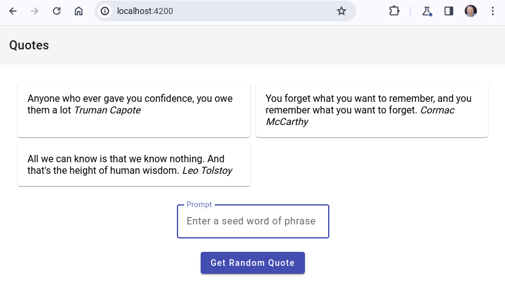
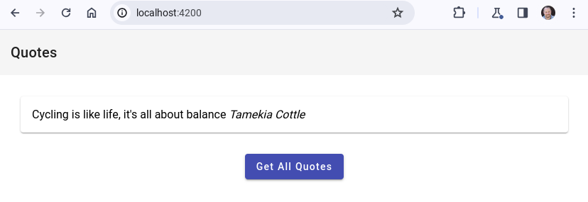

# End to End Demo

The end to end is a polygot solution that leverages two services; a Quotes Service which is actually written with Java Spring Boot and this project's .NET Random Quote Service.




There are 3 projects that make up the end to end scenario, you'll need to clone each into a separate directory and run them as follows.

## Run the .NET project
That's *this* project, so just run it.
```bash
dotnet run
```

## Run the Java project

Clone this [repository](https://github.com/GoogleCloudPlatform/serverless-production-readiness-java-gcp/) and run the following commands:

```bash
cd services/quotes

# build and run while skipping tests
> ./mvnw spring-boot:run -DskipTests

# test that you can retrieve some sample data from the Quotes service that is running
> curl localhost:8083/quotes
```
## Run the Web UI

Clone this [repository](https://github.com/jjdelorme/quotes-web) and run the following command:

```bash
# Install Angular and dependencies
npm install

# Build and serve the Angular application
npm run build
ng serve
```
